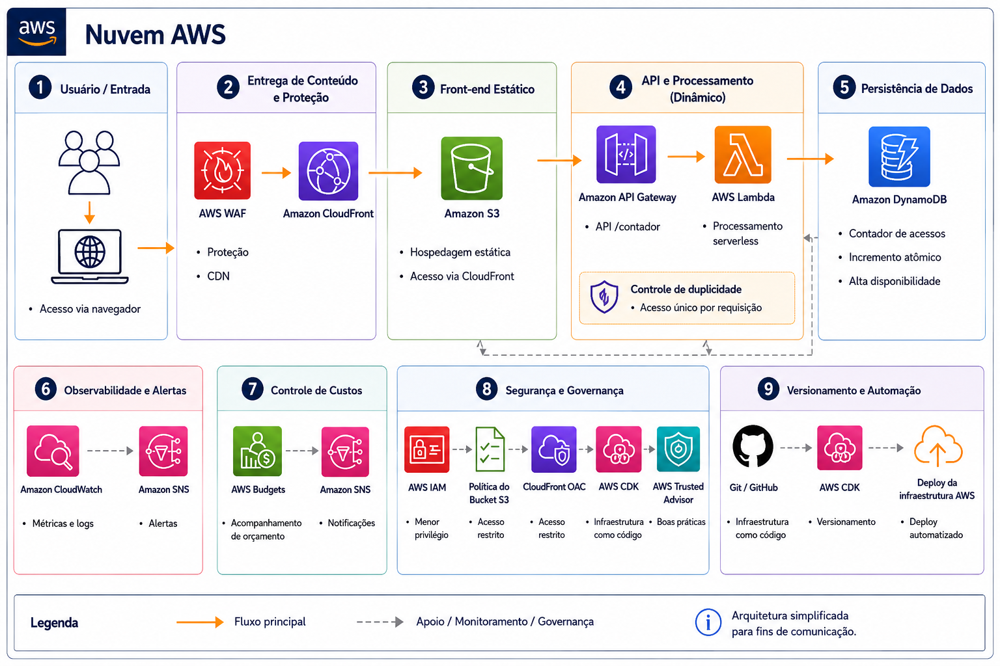

# Contador de Acessos Serverless na AWS

Projeto desenvolvido como Trabalho de Conclusão de Curso da **Escola da Nuvem**, no programa **AWS re/Start**, trilha **AWS Cloud Practitioner**, turma **BRSAO239**.

## Grupo 2

- Samuel Maia
- Mariana Monteiro
- André Marques
- Andreza Tavares
- Maycon Sá
- Rodrigo Abreu

## Contexto do problema

Uma startup criou uma página institucional de lançamento com o status **"Em Breve"** e precisa acompanhar a quantidade de acessos recebidos. A solução deve registrar visitas de forma automática, com baixo custo operacional, capacidade de escalar sob demanda e sem a necessidade de manter servidores dedicados.

## Objetivo da solução

Implementar uma arquitetura serverless na AWS para contabilizar acessos a uma página web. A proposta usa serviços gerenciados para receber requisições HTTP, executar a lógica de incremento do contador e armazenar o total de acessos de forma persistente.

## Arquitetura



## Documentação

- [Apresentação do TCC](docs/apresentacao-tcc.pdf)
- [Imagem da arquitetura](assets/arquitetura-serverless-aws.png)

## Serviços AWS utilizados

- **AWS WAF**: camada de proteção para requisições web.
- **Amazon CloudFront**: distribuição de conteúdo e entrega da aplicação com baixa latência.
- **Amazon S3**: hospedagem dos arquivos estáticos do frontend.
- **Amazon API Gateway**: exposição de um endpoint HTTP para receber chamadas da página.
- **AWS Lambda**: execução da lógica serverless responsável por incrementar o contador.
- **Amazon DynamoDB**: armazenamento do contador de acessos com atualização atômica.
- **Amazon CloudWatch**: coleta de logs, métricas e suporte à observabilidade da aplicação.
- **Amazon SNS**: envio de notificações e alertas.
- **AWS Budgets**: acompanhamento de custos e configuração de alertas de orçamento.
- **AWS IAM**: controle de permissões entre os serviços da arquitetura.
- **AWS CDK**: possibilidade de provisionamento da infraestrutura como código.
- **AWS Trusted Advisor**: apoio à revisão de boas práticas de segurança, custos e operação.

## Fluxo da arquitetura

1. O usuário acessa a aplicação pelo navegador.
2. A requisição passa por uma camada de proteção com AWS WAF e distribuição via Amazon CloudFront.
3. O CloudFront entrega o frontend estático armazenado no Amazon S3.
4. O frontend executa uma chamada `POST` para o endpoint `/contador` no Amazon API Gateway.
5. O API Gateway aciona uma função AWS Lambda.
6. A função Lambda utiliza o DynamoDB para incrementar o contador de forma atômica.
7. O DynamoDB retorna o novo valor do contador.
8. A Lambda retorna uma resposta JSON para o API Gateway.
9. Métricas, logs, alertas e acompanhamento de custos podem ser tratados com CloudWatch, SNS e AWS Budgets.

## Segurança

A solução foi pensada com foco em boas práticas de segurança para ambientes cloud:

- Uso de permissões mínimas no IAM, permitindo que a função Lambda acesse apenas a tabela DynamoDB necessária.
- Ausência de credenciais AWS, tokens ou chaves de acesso no código-fonte.
- Configuração de variáveis de ambiente para parâmetros como o nome da tabela.
- Possibilidade de aplicação de CORS no API Gateway de forma restrita ao domínio autorizado.
- Proteção de borda com AWS WAF e acesso ao S3 preferencialmente via CloudFront.
- Separação entre frontend, função de backend e infraestrutura.

## Observabilidade

A observabilidade pode ser realizada com o Amazon CloudWatch:

- Logs de execução da função Lambda.
- Métricas de invocação, erro e duração da Lambda.
- Métricas de requisições no API Gateway.
- Alarmes para falhas, aumento de erros ou comportamento inesperado.
- Notificações de alertas por Amazon SNS.

## Controle de custos

A arquitetura prioriza serviços com cobrança sob demanda:

- O Amazon S3 armazena e entrega arquivos estáticos com baixo esforço operacional.
- O Amazon CloudFront ajuda a otimizar entrega de conteúdo estático em escala.
- O API Gateway e a AWS Lambda cobram conforme o uso.
- O DynamoDB pode ser configurado em modo sob demanda para cenários com tráfego variável.
- O AWS Budgets pode apoiar o acompanhamento de gastos e alertas de orçamento.
- A ausência de servidores dedicados reduz custos de provisionamento, manutenção e ociosidade.

Nenhum valor real de custo foi estimado neste repositório, pois preços dependem de região, volume de acessos e configuração final dos serviços.

## Por que serverless?

Serverless é adequado para este cenário porque permite criar uma solução simples, escalável e orientada a eventos. A equipe não precisa administrar servidores, sistemas operacionais ou capacidade de infraestrutura. A AWS gerencia a execução dos serviços, enquanto a aplicação paga principalmente pelo uso efetivo.

## Estrutura do repositório

```text
aws-serverless-access-counter/
|-- README.md
|-- .gitignore
|-- LICENSE
|-- assets/
|   `-- arquitetura-serverless-aws.png
|-- docs/
|   `-- apresentacao-tcc.pdf
|-- frontend/
|   |-- index.html
|   |-- style.css
|   `-- script.js
|-- lambda/
|   |-- contador.py
|   `-- requirements.txt
`-- infra/
    `-- README.md
```

## Como executar localmente

O frontend é um exemplo estático e pode ser aberto diretamente no navegador:

```bash
cd frontend
```

Abra o arquivo `index.html` no navegador.

O arquivo `script.js` contém apenas uma simulação de chamada para o endpoint `/contador`. A URL real do Amazon API Gateway deve ser configurada futuramente, após a criação da infraestrutura na AWS.

## Função Lambda

A função em `lambda/contador.py` usa `boto3` e espera a variável de ambiente `TABLE_NAME`. O incremento é feito com `UpdateItem` e a operação `ADD`, garantindo atualização atômica no DynamoDB.

## Aprendizados do projeto

- Aplicação prática de arquitetura serverless na AWS.
- Separação entre frontend, backend e infraestrutura.
- Uso de API Gateway, Lambda e DynamoDB em uma solução orientada a eventos.
- Importância de permissões mínimas com IAM.
- Noções de observabilidade com CloudWatch.
- Organização de um repositório técnico para portfólio profissional.

## Autor e links profissionais

Projeto desenvolvido pelo **Grupo 2** da turma **BRSAO239**.

- Samuel Maia: [LinkedIn](https://linkedin.com/in/samuelmaia-analytics)
- Mariana Monteiro: [LinkedIn](https://www.linkedin.com/in/mariana-asm-tec/)
- GitHub do projeto: [aws-serverless-access-counter](https://github.com/samuelmaia-analytics/aws-serverless-access-counter)
