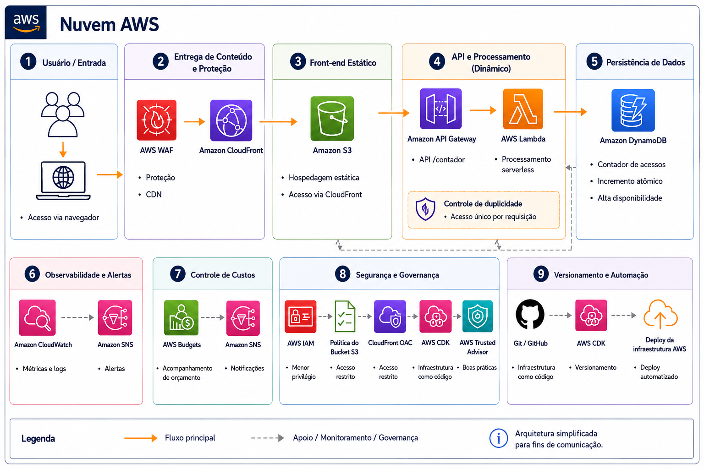

# Contador de Acessos Serverless na AWS

Projeto desenvolvido como Trabalho de Conclusão de Curso da **Escola da Nuvem**, no programa **AWS re/Start**, turma **BRSAO239**.

A solução demonstra uma arquitetura serverless para contabilizar acessos a uma página web com baixo esforço operacional, escalabilidade sob demanda, segurança e observabilidade.

## O problema

Uma startup precisa acompanhar acessos a uma página institucional sem manter servidores dedicados e sem criar uma infraestrutura complexa para um volume de tráfego variável.

## A solução



```text
Usuário
 → AWS WAF
 → CloudFront
 → S3
 → API Gateway
 → Lambda
 → DynamoDB
 → CloudWatch / SNS / Budgets
```

## Principais entregas

- Frontend estático preparado para hospedagem no Amazon S3.
- Distribuição de conteúdo via Amazon CloudFront.
- Endpoint HTTP via Amazon API Gateway.
- Função AWS Lambda para incremento do contador.
- Persistência atômica do total de acessos no Amazon DynamoDB.
- Controle de permissões com AWS IAM.
- Observabilidade com Amazon CloudWatch.
- Estratégia de alertas com Amazon SNS.
- Controle de custos com AWS Budgets.
- Camada de proteção de borda com AWS WAF.

## Valor demonstrado

O projeto mostra como substituir uma arquitetura baseada em servidor por serviços gerenciados e orientados a eventos, reduzindo necessidade de administração de infraestrutura e permitindo escalabilidade conforme o uso.

Nenhum percentual ou valor de economia é declarado, porque o custo real depende de região, volume de acessos e configuração final.

## Serviços AWS

**Frontend e entrega:** S3, CloudFront  
**Backend serverless:** API Gateway, Lambda, DynamoDB  
**Segurança:** WAF, IAM  
**Observabilidade e custos:** CloudWatch, SNS, AWS Budgets  
**Infraestrutura como código:** AWS CDK como caminho de evolução

## Segurança

- Princípio de menor privilégio no IAM.
- Ausência de credenciais AWS no código-fonte.
- Parâmetros sensíveis externalizados.
- Separação entre frontend, backend e infraestrutura.
- Possibilidade de restrição de CORS e proteção de borda.

## Como revisar este projeto em 5 minutos

1. Veja a arquitetura acima.
2. Leia `lambda/contador.py` para entender a lógica do contador.
3. Explore `frontend/` para o fluxo da aplicação.
4. Consulte `infra/` para a evolução de infraestrutura como código.
5. Abra a apresentação do TCC em `docs/apresentacao-tcc.pdf`.

## Estrutura

```text
aws-serverless-access-counter/
├── assets/
├── docs/
├── frontend/
├── lambda/
└── infra/
```

## Grupo 2

- Samuel Maia
- Mariana Monteiro
- André Marques
- Andreza Tavares
- Maycon Sá
- Rodrigo Abreu

## Aprendizados demonstrados

- Arquitetura serverless na AWS.
- Integração entre API Gateway, Lambda e DynamoDB.
- Segurança com IAM e WAF.
- Observabilidade com CloudWatch.
- Controle de custos em cloud.
- Organização de arquitetura técnica para apresentação executiva.

## Links

- [Apresentação do TCC](docs/apresentacao-tcc.pdf)
- [Arquitetura](assets/nuvem-aws-arquitetura-serverless.png)
- [LinkedIn — Samuel Maia](https://linkedin.com/in/samuelmaia-analytics)
